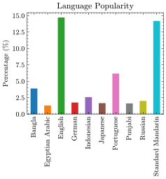

# Hello World Example/Userstory for testing
We want to focus on the human workflow in some existing tools to have somewhat of an unified test case. In this test case the user wants to know which are the most spoken languages.
The requirements for a "Hello World Example" are written down here: https://github.com/fairagro/m4.4_concept/issues/6#issuecomment-2286097413

## Scope of tested Tools
* Renku https://github.com/fairagro/m4.4_concept/issues/8
* REANA https://github.com/fairagro/m4.4_concept/issues/7
* Heliport https://github.com/fairagro/m4.4_concept/issues/11
* AIIDA https://github.com/fairagro/m4.4_concept/issues/10
* DataLad https://github.com/fairagro/m4.4_concept/issues/9
* ...?

## Definition of the "Human Workflow"
### Definition
There are some csv-Files already prepared. The first one is `population.csv` which contains the current population of all countries on earth. This one can be assumed to be local on the users disk. Two other csv Files `remote_data/speakers.csv` and `remote_data/speakers_revised.csv` are considered to be pulled from the internet (e.g. `wget` using their GitHub URL or [this Gist](https://gist.github.com/JensKrumsieck/c82a18402154dd452593230bbcf09f65))

The users intention is get the sum of humans on earth which can be used to calculate the percentage of speakers in each spoken language. The user than decides that using all languages is to convoluted and he just wants to use languages with more than 100.000.000 (100 Mio) speakers. There are two ways to achieve this: 1. using the revised csv-File or change the script. Both ways shall be tested. A python script is given: [`script.py`](./script.py). The file shall write a [`results.csv`](./results.csv) File with the percentage of speakers per Language which is also given for comparison. The user also wants to create a beautiful plot. And example script is given in [`plot.py`](./plot.py)

The user may is required to write a Workflow file (e.g. CWL) by hand to use the to-be-tested Tools...

### Desired Result
The desired `result.csv` is:
```csv
language,speakers,percentage
Bangla,300000000,3.8990180176129665
Egyptian Arabic,100542400,1.3067220971134996
English,1132366680,14.71706029288192
German,134993040,1.7544676507078263
Indonesian,198996550,2.5863037796427317
Japanese,128000000,1.663581020848199
Portuguese,475300000,6.177344212571477
Punjabi,125000000,1.6245908406720693
Russian,154000000,2.0014959157079892
Standard Mandarin,1090951810,14.178802545124924
```
The desired plot is



### Workflow
1. Read `population.csv` from local disk
2. Get the total population on earth
3. Download `speakers.csv`
4. Calculate the percentage of speakers by using the sum from *2*
5. There are two possible ways for modification, repeat 4 afterwards:
    1. Adjust the script to exclude languages with less then 100 Mio speakers
    2.  Download `speakers_revised.csv` 
6. Write `results.csv` for each step 
7. Plot Data to `results.svg`

## Data origin
The Data in the csv-Files is fetched from WikiData's SPARQL Endpoint using the script in `./dev`

